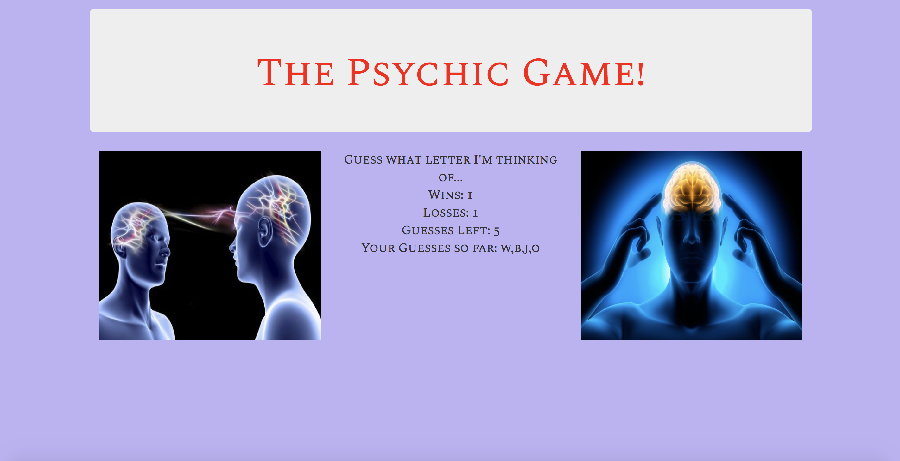

# Psychic-Game

Do you think you are psychic, but not quite sure? Take my test to find out!

## Instructions

* The program will think of a letter.
* You will enter the letter you think it is.
* You have nine tries.
* Play as many times as you like.

## Software

* [Javascript](https://www.javascript.com/)
* [Bootstrap](https://getbootstrap.com/)

# Authors

* **[Peter Juffernbruch](https://github.com/peterjuff)

# Acknowledgments

* **[Northwestern University Coding Bootcamp](https://bootcamp.northwestern.edu/coding/)
* Homework week three